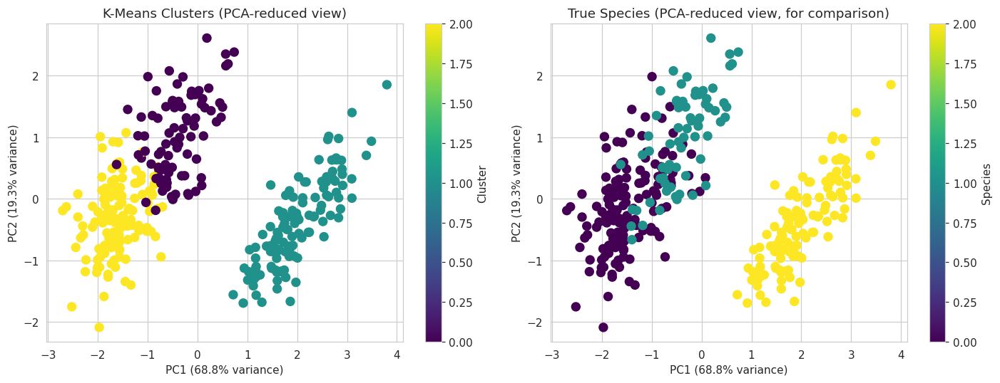
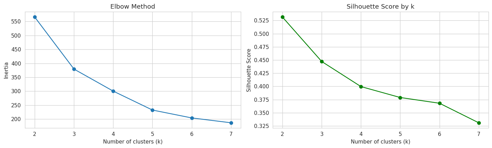

# Penguin Species Clustering

Unsupervised learning project that groups penguins into clusters using only physical measurements (no species labels used) — then checks how well the clusters match the real species.

## Dataset
344 penguins, 3 species (Adelie, Chinstrap, Gentoo), 4 measurements: bill length, bill depth, flipper length, body mass. Via seaborn.load_dataset("penguins").

## What's inside
- EDA on how species separate by physical traits
- Feature scaling (critical since body mass is in the thousands, bill depth in the teens)
- K-Means cluster selection via elbow method + silhouette score
- Evaluation against true species labels using Adjusted Rand Index
- Cluster profiling

## Results
- Adjusted Rand Index: 0.793 (1.0 = perfect match to true species) — clustering recovered real species structure with zero access to labels
- k=3 was chosen using domain knowledge (3 known species), even though silhouette score technically peaked at k=2
- Gentoo penguins were separated almost perfectly (123/123) due to distinct flipper length and body mass
- Adelie and Chinstrap were harder to separate since they're closer in size

## Visualizations

## Tech stack
Python, pandas, scikit-learn, seaborn, matplotlib, Jupyter

## How to run
git clone https://github.com/varunasree/penguin-species-clustering.git and open penguin.ipynb in Jupyter after installing requirements.txt

## License
MIT — see LICENSE file
